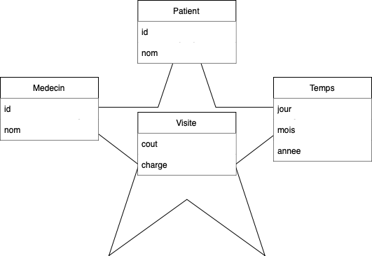
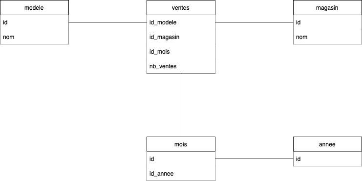
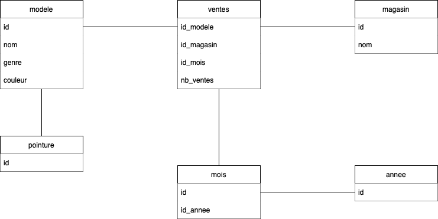

# Exercice 1 :
## 1. Un entrepôt de données peut être modélisé soit par un schéma en étoile, soit par un schéma en flocon. Décrivez brièvement les similitudes et les différences des deux modèles, puis analysez leurs avantages et inconvénients l'un par rapport à l'autre.
Parlons d'abord des similitudes entre un schéma en étoile et un schéma en flocon:
- Les deux modèles sont des modèles de données multidimensionnelles.
- Les deux modèles sont des modèles de données dénormalisés.
- Les deux modèles utilisent des tables relationnelles.

Les différences entre les deux modèles sont les suivantes:
- Le schéma en étoile est un modèle de données dénormalisé qui ne conserve pas le niveau de décomposition des données.
- Le schéma en étoile contient en son centre une table de faits et des tables de dimensions, alors que le schéma en flocon part sur une approche plus hiérarchique en utilisant des tables qui contiennent des informations générales qui sont détaillées dans des tables plus petites.
- L'avantage du schéma en étoile est qu'il est plus simple à mettre en place et à maintenir dans un premier temps, mais il est moins flexible que le schéma en flocon.
## 2. C’est quoi la différence entre OLAP et OLTP ?
OLTP (Online Transaction Processing) est un système de traitement de transactions qui permet de gérer les transactions de l'entreprise, tels que des achats, des ventes, des réservations, etc...

OLAP (Online Analytical Processing) est un système de traitement analytique de simulations ou de tendances sur un Hypercube qui permet de gérer les données de l'entreprise au moment d'un chargement ou de la mise à jour du cube. Il est utilisé pour les analyses afin d'extraire les donnéees souhaitées du cube. 

OLTP est donc utilisé pour les transactions de base de données, tandis que OLAP est utilisé pour les analyses et les rapports.
## 3. C’est quoi ETL ?
ETL (Extract, Transform, Load) est un processus qui permet d'extraire des données de sources multiples (BDD, fichiers, etc...) grâce à de multiples techniques (Push, Pull, etc...), de les transformer pour les rendre cohérentes et fiables et enfin de les charger dans un entrepôt de données. Il est utilisé pour la mise à jour périodique et répétée des données, en tout sécurité afin de ne pas perturber le OLTP.

On utilise en général l'ETL en amont d'une analyse OLAP, afin de mettre à jour les données de l'entrepôt de données et vérifier leur cohérence et intégrité.

# Exercice 2

Soit une table ventes (Magasin, Produit, Couleur, Prix). On suppose qu’il ya 2 magasins, 4 
produits et 3 couleurs et qu’il n'y a pas de valeurs nulles dans la table. On fait l'hypothèse que 
tous les magasins ont vendu chaque produit dans chacune des couleurs. 
On crée les vues suivantes:
``` 
create View VCube as 
select magasin, produit, couleur, sum(prix) as p 
From Ventes 
Group by Cube (magasin, produit, couleur); 
```
```
create View VRollup as 
Select magasin, produit, couleur, sum(prix) as p 
From Ventes 
Group by Rollup (magasin, produit, couleur); 
```

Donnez le nombre de n-uplets de chacune de ces deux vues : (Justifier votre reponse)

### VCube
- Il y a 2 magasins, 4 produits et 3 couleurs, donc `2*4*3 = 24 n-uplets`.
- Chaque magasin a vendu chaque produit, donc `4*2 = 8 n-uplets` par magasin.
- Chaque produit a été vendu dans chaque couleur, donc `3*4 = 12 n-uplets` par produit.
- Chaque couleur a été vendue dans chaque magasin, donc `2*3 = 6 n-uplets` par couleur.
- Il y a donc `24 + 8 + 12 + 6 = 50 n-uplets` dans la vue VCube.

### VRollup
- Il y a 2 magasins, 4 produits et 3 couleurs, donc `2*4*3 = 24 n-uplets`.
- Chaque magasin a vendu chaque produit, donc `4*2 = 8 n-uplets` par magasin.
- Il y a donc `24 + 8 = 32 n-uplets` dans la vue VRollup.

# Exercice 3
Supposons qu'un entrepôt de données se compose des trois dimensions temps, médecin et patient, et les deux mesures cout et charge, où la charge est la rémunération qu'un médecin facture à un patient pour une visite. 

## a) Dessinez un diagramme de schéma pour l'entrepôt de données ci-dessus en utilisant le schéma en étoile. 

## b) En commençant par le cube de base [jour ; médecin; patient], quelles opérations OLAP faut-il réaliser pour lister le total des honoraires perçus par chaque médecin en 2020 ?
- ROLLUP sur la dimension temps
- DRILLDOWN sur la dimension annee
- SLICE sur la dimension medecin
- DICE sur les honoraires perçus par chaque médecin en 2020

## c) Pour obtenir la même liste, écrivez une requête SQL en supposant que les données sont stockées dans une base de données relationnelle avec le schéma des frais (jour, mois, année, médecin, hôpital, patient, cout, charge).
```sql
SELECT medecin, SUM(charge) AS total
FROM frais
WHERE annee = 2020
GROUP BY medecin
```

# Exercice 4
La société Eram désire construire un entrepôt de données pour suivre l'évolution de ses ventes de chaussures. Supposant que l’entreprise est dispose de deux magasins « Eram_Paris » et « Eram_Lyon » et vend plusieurs modèles de chaussures.

## 1. Proposez un modèle conceptuel et logique d’entrepôt de données DW_Eram pour observer l’évolution des ventes en termes du nombre total de paires de chaussures vendues par rapport aux axes MOIS, ANNÉE, MAGASIN et MODÈLE. 
Comme on souhaite observer l'évolution des ventes en termes du nombre total de paires de chaussures vendues par rapport aux axes MOIS, ANNÉE, MAGASIN et MODÈLE, on peut utiliser le schéma en flocon. On a donc un fait `ventes` qui contient les informations sur les ventes de chaussures, et 4 dimensions `mois`, `annee`, `magasin` et `modele`.


## 2. Quel est le type du modèle obtenu ? Argumentez.
Le modèle obtenu est un schéma en flocon, car il y a une seule table de faits et plusieurs tables de dimensions, donc celle de `mois` qui est hierarchisée par `annee`.

## 3. On peut maintenant imaginer que la société désire aussi étudier la répartition de ses ventes suivant d'autres critères, comme Genre (Homme/Femme/Enfant), Pointure, ou encore Couleur. Proposer un nouveau modèle conceptuel de l’entrepôt de données DW_Eram_New en prenant en compte toutes les dimensions anciennes et nouvelles citées ci-dessus.


## 4. Soit la représentation relationnelle du data mart Eram_01. Proposez un tableau multidimensionnel pour observer le nombre total de paires de chaussures vendues par rapport aux axes MAGASIN et MODÈLE.
### a. Tableau multidimensionnel selon les 2 axes MAGASIN et MODÈLE.
|          | Eram_Paris | Eram_Lyon |
|----------|------------|-----------|
| Botte    | 7500       | 7000      |
| Escarpin | 5000       |           |
### b. Calculer l’opérateur CUBE sur le data mart Eram_01 avec l’approche ROLAP.
| Année | Modèle   | Magasin    | Nombre |
|-------|----------|------------|--------|
| 2000  | Botte    | Eram_Paris | 5000   |
| 2000  | Escarpin | Eram_Paris | 1500   |
| 2000  | Botte    | Eram_Lyon  | 3000   |
| 2001  | Escarpin | Eram_Paris | 3500   |
| 2001  | Botte    | Eram_Paris | 2500   |
| 2001  | Botte    | Eram_Lyon  | 4000   |
| ---   | -----    | -------    | ----   |
| Total | Botte    | Eram_Paris | 7500   |
| Total | Botte    | Eram_Lyon  | 7000   |
| Total | Escarpin | Eram_Lyon  | 5000   |
| 2000  | Total    | Eram_Paris | 6500   |
| 2000  | Total    | Eram_Lyon  | 3000   |
| 2001  | Total    | Eram_Paris | 6000   |
| 2000  | Total    | Eram_Lyon  | 4000   |
| 2000  | Botte    | Total      | 8000   |
| 2000  | Escarpin | Total      | 1500   |
| 2001  | Botte    | Total      | 6500   |
| 2001  | Escarpin | Total      | 3500   |
| Total | Total    | Eram_Paris | 12500  |
| Total | Total    | Eram_Lyon  | 7000   |
| Total | Botte    | Total      | 14500  |
| Total | Escarpin | Total      | 5000   |
| 2000  | Total    | Total      | 9500   |
| 2001  | Total    | Total      | 10000  |
| Total | Total    | Total      | 19500  |
