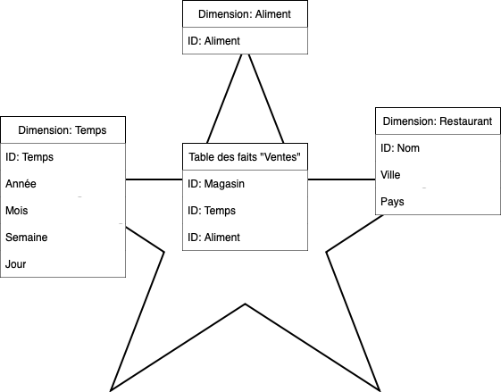
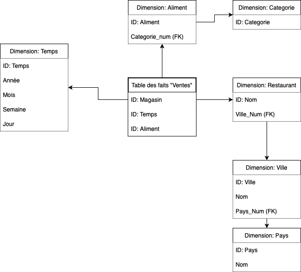
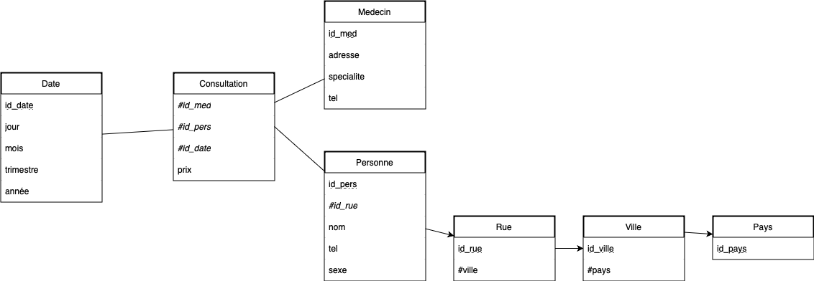
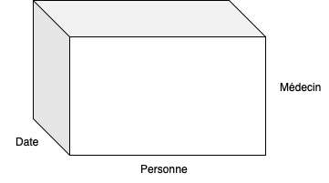

# Partie 1 : Etude de cas 
## Exercice 1 : Modélisation d’un SI décisionnel
### 1. Énumérez  trois  principaux  types  de  schémas  couramment  utilisés  pour  modéliser  les entrepôts de données.
- Schéma en étoile
- Schéma en flocon
- Schéma en constellation
### 2. Identifier les dimensions et les mesures.
- Dimensions : temps, restaurant, aliment
- Mesures : quantité vendue, bénéfice
### 3. Concevoir un modèle en étoile pour ce DW.

### 4. Modifier  ce  modèle  en  un  modèle  en  flocon  de  neige  pour  modéliser  explicitement  les hiérarchies  des  dimensions  représentant  le  temps  et  la  localisation  géographique  des magasins.


## Exercice 2 : Représentation et les opérations du cube OLAP
### 1. Proposer un schéma en flocon qui tienne compte de la date, du jour de la semaine, du mois, du trimestre et de l’année.

### 2. Quelle est la table des faits? Et quelles sont les mesures ?
- Table des faits : Consultation
- Mesures : nombre de consultations, prix des consultations, dates des consultations
### 3. Quelles sont les dimensions qui ont été retenues ?
- Dimensions : temps, médecin, patient
### 4. Quelles sont les hiérarchies des dimensions?
- temps: date -> jour de la semaine -> mois -> trimestre -> année
### 5. Faites une représentation du cube OLAP sans tenir compte des hiérarchies. 

### 6. A partir de ce cube, indiquez quelles opérations OLAP (roll up, drill down, slice, dice) il faut appliquer pour obtenir les informations suivantes : 
#### a. Le cout total des consultations par médecin en 2018 et 2020. 
- Roll up sur le coût des consultations
- Slice sur les années 2018 et 2020
#### b. Le nombre de consultations par jour de la semaine, par spécialité et par sexe du patient. 
- Roll up sur le nombre de consultations
- Slice sur le jour de la semaine
- Dice sur la spécialité et le sexe du patient 
#### c. Le cout des consultations par patiente pour les mois d’octobre. 
- Roll up sur le coût des consultations
- Slice sur le mois d’octobre
# Partie 2 : Manipulation des données Cube
### 1. Créez la table client comme suit : 
```sql
drop table client;  
create table client (codecli varchar2(10), nomcli varchar2(10), catcli number(1), vilcli 
varchar2(10), paycli varchar2(10), cacli number(10,2), constraint pk_cli primary key (codecli));
```
### 2. Insérer les informations suivantes dans le tableau : 
```sql
 ('C1','VICTOR',1, 'Paris', 'France', 10000); 
 ('C2','CAMILLE', 1, 'Poitiers', 'France', 2000);  
 ('C3','UNIQUE', 2, 'Nice', 'France', 1500);  
 ('C4','CORDOUX', 1, 'Madrid','Espagne',3000);  
 ('C5','PUISSANT', 1, 'Lyon', 'France', 2000);  
 ('C6','HUGO', 3, 'Paris', 'France', 4000); 
 ('C7','ADAM', 3, 'Rabat', 'Maroc',10000);  
 ('C8','TRAIFORT', 1, 'Sousse','Tunisie',20000); 
```
```sql
insert into client values ('C1','VICTOR',1, 'Paris', 'France', 10000);
insert into client values ('C2','CAMILLE', 1, 'Poitiers', 'France', 2000);
insert into client values ('C3','UNIQUE', 2, 'Nice', 'France', 1500);
insert into client values ('C4','CORDOUX', 1, 'Madrid','Espagne',3000);
insert into client values ('C5','PUISSANT', 1, 'Lyon', 'France', 2000);
insert into client values ('C6','HUGO', 3, 'Paris', 'France', 4000);
insert into client values ('C7','ADAM', 3, 'Rabat', 'Maroc',10000);
insert into client values ('C8','TRAIFORT', 1, 'Sousse','Tunisie',20000);
```
### 3. Afficher tous les Clients 
```sql
select * from client;
```
### 4. Créer une table commende avec numcom varchar2(10), codecli varchar2(10), datecom 
date, contrainte clé primaire pk_com (numcom) ;
```sql
drop table commande;
create table commande (numcom varchar2(10), codecli varchar2(10), datecom date, constraint pk_com primary key (numcom));
```
### 5. Insérer les informations suivantes dans les valeurs : 
```sql
 ('N1', 'C1', '17-SEP-2009');  
 ('N2', 'C1', '18-SEP-2009');  
 ('N3', 'C7', '17-SEP-2009');
```
```sql
insert into commande values ('N1', 'C1', '17-SEP-2009');
insert into commande values ('N2', 'C1', '18-SEP-2009');
insert into commande values ('N3', 'C7', '17-SEP-2009');
```
### 6. Afficher toutes les commandes 
```sql
select * from commande;
```
### 7. Faire un joint entre les deux tables en sélectionnant toutes les commandes
```sql
select * from commande join client on commande.codecli = client.codecli;
```
### 8. Faire  une  requête  de  jointure  full  outer  entre  les  deux  tables  (client  et  commende),  expliquer le résultat.
```sql
select * from commande full outer join client on commande.codecli = client.codecli;
```
La résultat affiche des NULL à cause du manque de correspondance entre les deux tables.
### 9. Faire une requête de jointure gauche en utilisant la requête select, expliquer le résultat
```sql
select * from commande left join client on commande.codecli = client.codecli;
```
Le résultat est le même que la simple requête join car on prend seulement les colonnes communes
### 10. Faire une jointure right outer à l'aide d'une requête de sélection.
```sql
select * from commande right join client on commande.codecli = client.codecli;
```
### 11. Afficher/sélectionner le nombre de clients.
```sql
select count(*) from client;
```
`8`
### 12. Afficher/sélectionner le nombre de pays.
```sql
select count(distinct paycli) from client;
```
`4`
### 13. Afficher/sélectionner le nombre de clients par catégorie
```sql
select catcli, count(*) from client group by catcli;
```
```
"1"	| "5"
"2" | "1"
"3"	| "2"
```
### 14. Sélectionnez le nombre de clients par catégorie et par ville
```sql
select catcli, vilcli, count(*) from client group by catcli, vilcli;
```
```
"1"	"Lyon"	    "1"
"1"	"Madrid"	"1"
"1"	"Paris"	    "1"
"1"	"Poitiers"	"1"
"1"	"Sousse"	"1"
"2"	"Nice"	    "1"
"3"	"Paris"	    "1"
"3"	"Rabat" 	"1"
```
### 15. Sélectionnez le nombre de clients par catégorie et par ville à l'aide de CUBE. 
```sql
select catcli, vilcli, count(*) from client group by cube(catcli, vilcli);
```
### 16. Sélectionnez le nombre de clients par catégorie et par ville à l'aide de ROLLUP.
```sql
select catcli, vilcli, count(*) from client group by rollup(catcli, vilcli);
```
```
"null"	"null"	"8"
"1"	"Poitiers"  "1"
"3"	"Rabat"	    "1"
"1"	"Sousse"	"1"
"2"	"Nice"	    "1"
"3"	"Paris"	    "1"
"1"	"Madrid"	"1"
"1"	"Lyon"	    "1"
"1"	"Paris" 	"1"
"3"	"null"	    "2"
"2"	"null"  	"1"
"1"	"null"  	"5"
```
### 17. Trier les clients par ordre décroissant par CACLI 
```sql
select * from client order by cacli desc;
```
18. Trier les clients en ordre décroissant par CACLI et donnez le Rang. 
```sql
select *, row_number() over (order by cacli desc) as rang from client;
```
```
"C8"	"TRAIFORT"	"1"	"Sousse"	"Tunisie"	"20000"	"1"
"C1"	"VICTOR"	"1"	"Paris"	"France"	"10000"	"2"
"C7"	"ADAM"	"3"	"Rabat"	"Maroc"	"10000"	"3"
"C6"	"HUGO"	"3"	"Paris"	"France"	"4000"	"4"
"C4"	"CORDOUX"	"1"	"Madrid"	"Espagne"	"3000"	"5"
"C5"	"PUISSANT"	"1"	"Lyon"	"France"	"2000"	"6"
"C2"	"CAMILLE"	"1"	"Poitiers"	"France"	"2000"	"7"
"C3"	"UNIQUE"	"2"	"Nice"	"France"	"1500"	"8"
```