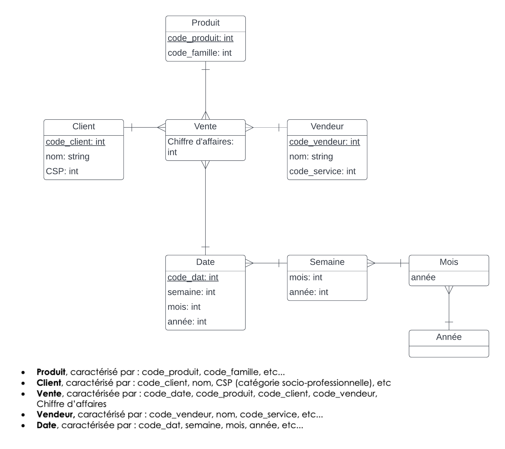
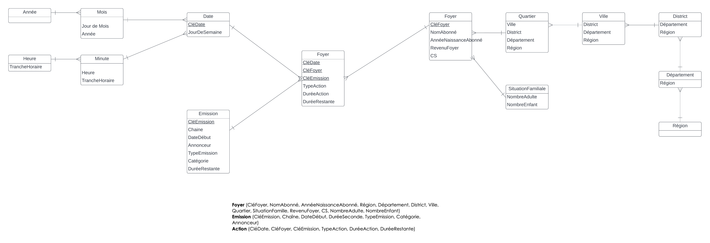

Anthony Manikhouth M2LSI2

# TP1: Modélisation et Conception d'un DW

## Exercice 1
### Question 1
- Les **tables de faits** sont des tables qui contiennent des informations sur les faits d'affaires, souvent exprimés en valeurs numériques. 
- Les **tables de dimensions** sont des tables qui contiennent des informations sur le contexte des faits d'affaires. Elles sont souvent exprimées en valeurs catégorielles grâce à des attributs.
- Les **indicateurs** (ou faits) sont des données agrégées qui permettent de mesurer les performances d'une entreprise. Ils sont souvent exprimés en valeurs numériques (ex: chiffre d'affaires, nombre de clients, nombre de ventes, etc.).
- Les **hiérarchies** dimensionnelles sont des structures hiérarchiques qui permettent de regrouper des données en fonction de leur contexte. Elles sont souvent exprimées en valeurs catégorielles (ex: pays, région, ville, etc.).
### Question 2

## Exercice 2
### Question 1
La **table de faits** est la table qui contient les données agrégées sur les faits d'affaires, donc logiquement celle d'**Action** puisque c'est celle qui permettra d'estimer les revenus. 
### Question 2
- **Date** : date de l'action
- **Client** : client qui a effectué l'action
- **Emission** : emission concerné par l'action
- **Type** : type d'action (achat, location, etc.)
- **Durée**: durée de l'action
### Question 3

### Question 4
Formulez trois requêtes différentes qu’on peut poser au DW. 
- Quelle est la durée moyenne d’une action par client ?
- Quel est le nombre d’actions moyen par client ?
- Quelle est la durée moyenne d’une action par type d’action ?
### Question 5
```
Foyer (CléFoyer, NomAbonné, AnnéeNaissanceAbonné, Région, SituationFamille, RevenuFoyer, CS, NombreAdulte, NombreEnfant) 
```
## Exercice 3